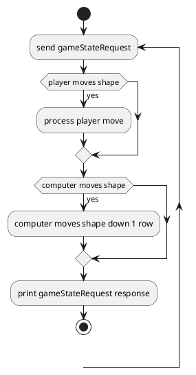

# Game Loop

```plantuml
@startuml
start

repeat :send gameStateRequest;

if(player moves shape) then (yes)
:process player move;
endif

if(computer moves shape) then (yes)
:computer moves shape down 1 row;
endif

:print gameStateRequest response;

stop
@enduml
```
